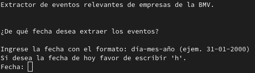
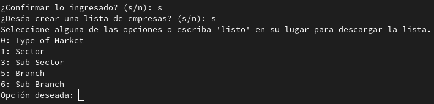
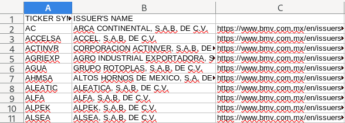
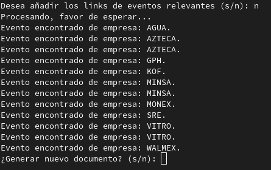
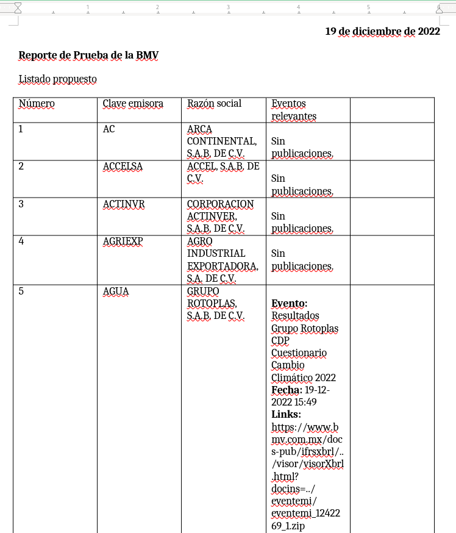
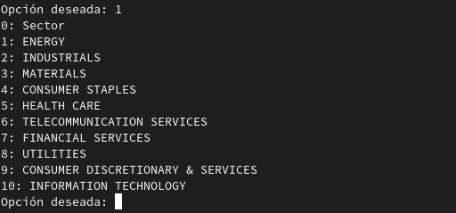
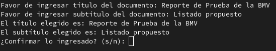

# Extractor de eventos relevantes de empresas de la Bolsa Mexicana de Valorwes

## En pocas palabras

Básicamente se trata de una automatización que conjunta tres ámbitos: la interacción con internet (este programa puede ser considerado como un 'bot'),
la automatización de excel y de word.

El programa permite interactuar y extraer en tiempo real información de la página de la BMV, así mismo genera un excel que utiliza como su pequeña base de
datos, posteriormente utiliza dicho excel para generar un reporte en word con todas las publicaciones de eventos relevantes que encontró para cada una de las 
empresas de acuerdo a la fecha solicitada.



## Estructura

Se trata de un programa que se divide en:

- Formador de listados: Es capáz de descargar de la página de la BMV una serie de listados de empresas de acuerdo a distintos criterios,
permitiendo al usuario experimentar con distintos criterios en tiempo real dependiendo de las categorías que elija.
Por ejemplo, el usuario podría solicitar un mercado y submercado específicos, para ciertos tipos de instrumentos, recibiendo el listado
correspondiente utilizando directamente los filtros de la página de la BMV. Asímismo, es posible proveerle un listado personalizado siguiendo
el formato de [excel](./listaEmpresas.xls).



- Editor de listados: Si bien la página de la BMV nos permite descargar un listado, se tendría que buscar manualmente cada una de las empresas
para encontrar sus perfiles y adicionalmente acceder a las publicaciones de eventos relevantes que se hace de cada una de ellas, cuestión que 
consume demasiado tiempo y esfuerzo. Es por esto que a dicho listado le agrega a cada una de las empresas los links correspondientes, de manera
que el programa los pueda reutilizar cada vez que se ejecute.



- Extractor de eventos: Una vez que se tiene el listado final con los links, procede a hacer la revisión de los eventos relevantes por cada una
de las empresas, el gran beneficio del programa es que sin importar las categorias de eventos o la cantidad de los mismos, procede a hacer una 
revisión completa de todas las categorias y la totalidad de los eventos, razón por la cual puede ser usado con busquedas de cualquier fecha.



- Generador de reporte: Una vez que haya encontrado los eventos relevantes, genera un documento de word personalizado de acuerdo a las empresas del
listado y agrega la información del título del evento, la fecha (con hora) y los links para acceder al documento completo.



## Aplicaciones

Es un programa que puede servir tanto en ámbito financiero como en el jurídico, particularmente para el derecho bursatil, puesto que al hacer un seguimiento
de ciertas empresas podemos mantener informados a los clientes de cualquier acontecimeinto que sea relevante para el manejo de su negocio en su caso para
utilizarlo como información que sea de utilidad para tomar decisiones de inversión.

## Instalación

Se requiere tener:
```python
pip 22.3.1

python =< 3.11

git =< 2.38.1
```

Ejecutar en la terminal el comando:

```bash
git clone https://github.com/DeLamDev/BMV.git
```

Posteriormente debe acceder al directorio del programa:

```bash
cd BMV
```

Dentro del mismo directorio deel programa, ejecutar el siguiente comando:

```python
pip install -r requirements.txt
```

## Utilización

Simplemente deberá ingresar al directorio donde haya clonado el repositorio y ejecutar:

```python
python3 bmv.py
```

Si desea utilizar una lista personalizada debe asegurarse de seguir el formato de [ejemplo](./listaEmpresas.xls), el word se genera a partir de dicha lista.

## Notas adicionales

Hay tres datos esenciales para poder utilizar un listado personalizado:
- Clave de la empresas
- Razón social
- Link de su perfil (de la versión en INGLES de la página de la BMV)
* Se debe respetar el orden que viene en el ejemplo.

El driver de Selenium lo utilizo con Firefox, por lo que en su caso deberá instalarlo o modificar el código para utilizar el navegador de su preferencia.

El formato de excel que viene de ejemplo SIEMPRE se debe de respetar, por lo que las empresas en todo caso deben escribirse a partir de la segunda fila y respetando el
orden de la información en las columnas.

Al momento de elegir los criterios principales para fomar un listado:


Se depligan las opciones dependiendo de la categoria elegida:



Hay que tener cuidado en no elegir la opción de <b>listo</b> cuando se visualizan las opciones de una categoria, la opción <b>0</b> siempre es equivalente a no seleccionar
ninguna opción, SIEMPRE hay que seleccionar <b>listo</b> solo desde los criterios principales (estos se actualizan conforme uno hace elecciones), si estos llegan a cambiar después
de elegir una opción quiere decir que son incompatibles, esto no es un error, sino que simplemente así es como funciona el código de la página de la BMV.

El programa arregla un error de programación de la BMV, ya que en algunas selecciones con criterios muy específicos la página nos devuelve un documento remarcando que hubo un error,
esto lo resolví construyendo un lista manualmente usando opciones que se despliegan en tiempo real, a pesar de que va a avisar del error, no hay que preocuparse puesto que el propio
programa lo soluciona.

Finalmente, hay que destacar que si ya se ha generado un reporte este solo se actualiza en la tabla, por lo que es más conveniente elegir generar un nuevo documento cuando desees
cambiar el título, subtítulo y la fecha.



Como último recordatorios los reportes y el excel se guardan en el directorio desde el que se ejecuta el programa.
